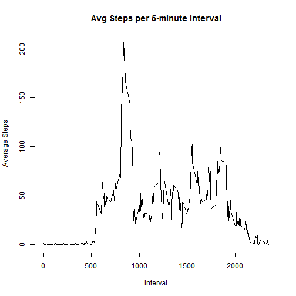

# Reproducible Research: Peer Assessment 1


## Loading and preprocessing the data
The activity data is included as a .ZIP file in the repository. The ZIP archive contains a comma-delimited data file, **activity.csv**, that is extracted into the **data** directory and then read into a variable for later use. Also, a variable version of the data excluding missing values is created.

```r
unzip("activity.zip", exdir="data")

activities <- read.csv("data/activity.csv")
# create a dataset excluding the missing step values
noMissingValues <- activities[!is.na(activities$steps),]
```


## What is mean total number of steps taken per day?
Aggregate the number of steps taken each day. Results are show in the following historgram.

```r
stepsPerDay <- aggregate(noMissingValues$steps, list(day=noMissingValues$date), sum)
hist(stepsPerDay$x, breaks=50, xlab="Total number of steps", main="Steps per Day")
```

 

Calculate the **mean** and **median** total number of steps per day.

```r
meanPerDay <- aggregate(noMissingValues$steps, list(day=noMissingValues$date), mean)
medianPerDay <- aggregate(noMissingValues$steps, list(day=noMissingValues$date), median)
# merge the mean and median steps into a single dataset for display in a table
meanAndMedianPerDay <- merge(meanPerDay, medianPerDay, by.x="day", by.y="day", suffixes=c("_mean","_median"))
names(meanAndMedianPerDay) <- c("Day","Mean","Median")

library(xtable)
xt <- xtable(meanAndMedianPerDay)
print(xt, type="html")
```

<!-- html table generated in R 3.1.0 by xtable 1.7-3 package -->
<!-- Sat Jul 19 15:40:27 2014 -->
<TABLE border=1>
<TR> <TH>  </TH> <TH> Day </TH> <TH> Mean </TH> <TH> Median </TH>  </TR>
  <TR> <TD align="right"> 1 </TD> <TD> 2012-10-02 </TD> <TD align="right"> 0.44 </TD> <TD align="right"> 0.00 </TD> </TR>
  <TR> <TD align="right"> 2 </TD> <TD> 2012-10-03 </TD> <TD align="right"> 39.42 </TD> <TD align="right"> 0.00 </TD> </TR>
  <TR> <TD align="right"> 3 </TD> <TD> 2012-10-04 </TD> <TD align="right"> 42.07 </TD> <TD align="right"> 0.00 </TD> </TR>
  <TR> <TD align="right"> 4 </TD> <TD> 2012-10-05 </TD> <TD align="right"> 46.16 </TD> <TD align="right"> 0.00 </TD> </TR>
  <TR> <TD align="right"> 5 </TD> <TD> 2012-10-06 </TD> <TD align="right"> 53.54 </TD> <TD align="right"> 0.00 </TD> </TR>
  <TR> <TD align="right"> 6 </TD> <TD> 2012-10-07 </TD> <TD align="right"> 38.25 </TD> <TD align="right"> 0.00 </TD> </TR>
  <TR> <TD align="right"> 7 </TD> <TD> 2012-10-09 </TD> <TD align="right"> 44.48 </TD> <TD align="right"> 0.00 </TD> </TR>
  <TR> <TD align="right"> 8 </TD> <TD> 2012-10-10 </TD> <TD align="right"> 34.38 </TD> <TD align="right"> 0.00 </TD> </TR>
  <TR> <TD align="right"> 9 </TD> <TD> 2012-10-11 </TD> <TD align="right"> 35.78 </TD> <TD align="right"> 0.00 </TD> </TR>
  <TR> <TD align="right"> 10 </TD> <TD> 2012-10-12 </TD> <TD align="right"> 60.35 </TD> <TD align="right"> 0.00 </TD> </TR>
  <TR> <TD align="right"> 11 </TD> <TD> 2012-10-13 </TD> <TD align="right"> 43.15 </TD> <TD align="right"> 0.00 </TD> </TR>
  <TR> <TD align="right"> 12 </TD> <TD> 2012-10-14 </TD> <TD align="right"> 52.42 </TD> <TD align="right"> 0.00 </TD> </TR>
  <TR> <TD align="right"> 13 </TD> <TD> 2012-10-15 </TD> <TD align="right"> 35.20 </TD> <TD align="right"> 0.00 </TD> </TR>
  <TR> <TD align="right"> 14 </TD> <TD> 2012-10-16 </TD> <TD align="right"> 52.38 </TD> <TD align="right"> 0.00 </TD> </TR>
  <TR> <TD align="right"> 15 </TD> <TD> 2012-10-17 </TD> <TD align="right"> 46.71 </TD> <TD align="right"> 0.00 </TD> </TR>
  <TR> <TD align="right"> 16 </TD> <TD> 2012-10-18 </TD> <TD align="right"> 34.92 </TD> <TD align="right"> 0.00 </TD> </TR>
  <TR> <TD align="right"> 17 </TD> <TD> 2012-10-19 </TD> <TD align="right"> 41.07 </TD> <TD align="right"> 0.00 </TD> </TR>
  <TR> <TD align="right"> 18 </TD> <TD> 2012-10-20 </TD> <TD align="right"> 36.09 </TD> <TD align="right"> 0.00 </TD> </TR>
  <TR> <TD align="right"> 19 </TD> <TD> 2012-10-21 </TD> <TD align="right"> 30.63 </TD> <TD align="right"> 0.00 </TD> </TR>
  <TR> <TD align="right"> 20 </TD> <TD> 2012-10-22 </TD> <TD align="right"> 46.74 </TD> <TD align="right"> 0.00 </TD> </TR>
  <TR> <TD align="right"> 21 </TD> <TD> 2012-10-23 </TD> <TD align="right"> 30.97 </TD> <TD align="right"> 0.00 </TD> </TR>
  <TR> <TD align="right"> 22 </TD> <TD> 2012-10-24 </TD> <TD align="right"> 29.01 </TD> <TD align="right"> 0.00 </TD> </TR>
  <TR> <TD align="right"> 23 </TD> <TD> 2012-10-25 </TD> <TD align="right"> 8.65 </TD> <TD align="right"> 0.00 </TD> </TR>
  <TR> <TD align="right"> 24 </TD> <TD> 2012-10-26 </TD> <TD align="right"> 23.53 </TD> <TD align="right"> 0.00 </TD> </TR>
  <TR> <TD align="right"> 25 </TD> <TD> 2012-10-27 </TD> <TD align="right"> 35.14 </TD> <TD align="right"> 0.00 </TD> </TR>
  <TR> <TD align="right"> 26 </TD> <TD> 2012-10-28 </TD> <TD align="right"> 39.78 </TD> <TD align="right"> 0.00 </TD> </TR>
  <TR> <TD align="right"> 27 </TD> <TD> 2012-10-29 </TD> <TD align="right"> 17.42 </TD> <TD align="right"> 0.00 </TD> </TR>
  <TR> <TD align="right"> 28 </TD> <TD> 2012-10-30 </TD> <TD align="right"> 34.09 </TD> <TD align="right"> 0.00 </TD> </TR>
  <TR> <TD align="right"> 29 </TD> <TD> 2012-10-31 </TD> <TD align="right"> 53.52 </TD> <TD align="right"> 0.00 </TD> </TR>
  <TR> <TD align="right"> 30 </TD> <TD> 2012-11-02 </TD> <TD align="right"> 36.81 </TD> <TD align="right"> 0.00 </TD> </TR>
  <TR> <TD align="right"> 31 </TD> <TD> 2012-11-03 </TD> <TD align="right"> 36.70 </TD> <TD align="right"> 0.00 </TD> </TR>
  <TR> <TD align="right"> 32 </TD> <TD> 2012-11-05 </TD> <TD align="right"> 36.25 </TD> <TD align="right"> 0.00 </TD> </TR>
  <TR> <TD align="right"> 33 </TD> <TD> 2012-11-06 </TD> <TD align="right"> 28.94 </TD> <TD align="right"> 0.00 </TD> </TR>
  <TR> <TD align="right"> 34 </TD> <TD> 2012-11-07 </TD> <TD align="right"> 44.73 </TD> <TD align="right"> 0.00 </TD> </TR>
  <TR> <TD align="right"> 35 </TD> <TD> 2012-11-08 </TD> <TD align="right"> 11.18 </TD> <TD align="right"> 0.00 </TD> </TR>
  <TR> <TD align="right"> 36 </TD> <TD> 2012-11-11 </TD> <TD align="right"> 43.78 </TD> <TD align="right"> 0.00 </TD> </TR>
  <TR> <TD align="right"> 37 </TD> <TD> 2012-11-12 </TD> <TD align="right"> 37.38 </TD> <TD align="right"> 0.00 </TD> </TR>
  <TR> <TD align="right"> 38 </TD> <TD> 2012-11-13 </TD> <TD align="right"> 25.47 </TD> <TD align="right"> 0.00 </TD> </TR>
  <TR> <TD align="right"> 39 </TD> <TD> 2012-11-15 </TD> <TD align="right"> 0.14 </TD> <TD align="right"> 0.00 </TD> </TR>
  <TR> <TD align="right"> 40 </TD> <TD> 2012-11-16 </TD> <TD align="right"> 18.89 </TD> <TD align="right"> 0.00 </TD> </TR>
  <TR> <TD align="right"> 41 </TD> <TD> 2012-11-17 </TD> <TD align="right"> 49.79 </TD> <TD align="right"> 0.00 </TD> </TR>
  <TR> <TD align="right"> 42 </TD> <TD> 2012-11-18 </TD> <TD align="right"> 52.47 </TD> <TD align="right"> 0.00 </TD> </TR>
  <TR> <TD align="right"> 43 </TD> <TD> 2012-11-19 </TD> <TD align="right"> 30.70 </TD> <TD align="right"> 0.00 </TD> </TR>
  <TR> <TD align="right"> 44 </TD> <TD> 2012-11-20 </TD> <TD align="right"> 15.53 </TD> <TD align="right"> 0.00 </TD> </TR>
  <TR> <TD align="right"> 45 </TD> <TD> 2012-11-21 </TD> <TD align="right"> 44.40 </TD> <TD align="right"> 0.00 </TD> </TR>
  <TR> <TD align="right"> 46 </TD> <TD> 2012-11-22 </TD> <TD align="right"> 70.93 </TD> <TD align="right"> 0.00 </TD> </TR>
  <TR> <TD align="right"> 47 </TD> <TD> 2012-11-23 </TD> <TD align="right"> 73.59 </TD> <TD align="right"> 0.00 </TD> </TR>
  <TR> <TD align="right"> 48 </TD> <TD> 2012-11-24 </TD> <TD align="right"> 50.27 </TD> <TD align="right"> 0.00 </TD> </TR>
  <TR> <TD align="right"> 49 </TD> <TD> 2012-11-25 </TD> <TD align="right"> 41.09 </TD> <TD align="right"> 0.00 </TD> </TR>
  <TR> <TD align="right"> 50 </TD> <TD> 2012-11-26 </TD> <TD align="right"> 38.76 </TD> <TD align="right"> 0.00 </TD> </TR>
  <TR> <TD align="right"> 51 </TD> <TD> 2012-11-27 </TD> <TD align="right"> 47.38 </TD> <TD align="right"> 0.00 </TD> </TR>
  <TR> <TD align="right"> 52 </TD> <TD> 2012-11-28 </TD> <TD align="right"> 35.36 </TD> <TD align="right"> 0.00 </TD> </TR>
  <TR> <TD align="right"> 53 </TD> <TD> 2012-11-29 </TD> <TD align="right"> 24.47 </TD> <TD align="right"> 0.00 </TD> </TR>
   </TABLE>

```r
# find the total mean/median for all steps
totalMean <- mean(noMissingValues$steps)
totalMedian <- median(noMissingValues$steps)
print(paste("Mean of all steps: ", totalMean))
```

[1] "Mean of all steps:  37.3825995807128"

```r
print(paste("Median of all steps: ", totalMedian))
```

[1] "Median of all steps:  0"

Notice that all daily median values are 0. This is due to the fact that most of the interval step values are 0 for each day. We can calculate the average percentage of intervals that are zero per day.

```r
# from the dataset excluding missing values, find all zero step intervals
zeroStepIntervals <- noMissingValues[noMissingValues$steps == 0,]
# get the zero step intervals for all dates
zeroStepIntervalsPerDay <- aggregate(zeroStepIntervals$steps, list(day=zeroStepIntervals$date), length)
# calc the mean zero intervals per day
meanZeroIntervalPct <- (mean(zeroStepIntervalsPerDay$x) / length(unique(noMissingValues$interval))) * 100
sprintf("Avg zero intervals per day (excluding missing obs.): %.2f", meanZeroIntervalPct)
```

```
## [1] "Avg zero intervals per day (excluding missing obs.): 72.16"
```

With such a high percentage of zero step intervals, it is not surprising that the median daily steps are zero.


## What is the average daily activity pattern?
Calculate the average number of steps per 5-minute interval, averaged across all days. The results are displayed in the following time series plot.

```r
intervalMeans <- aggregate(noMissingValues$steps, list(interval=noMissingValues$interval), mean)

plot(intervalMeans$x ~ intervalMeans$interval, type="l", xlab="Interval", ylab="Average Steps", main="Avg Steps per 5-minute Interval")
```

 

Find the 5-minute interval, on average across all days, with the maximum number of steps

```r
maxMeanInterval <- intervalMeans[intervalMeans$x == max(intervalMeans$x), c("interval")]
print(paste("Interval with max steps: ", maxMeanInterval))
```

```
## [1] "Interval with max steps:  835"
```

## Imputing missing values
Caluclate the number of missing rows in the activities data.

```r
numOfMissing <- nrow(activities[is.na(activities$steps),])
print(paste("Number of missing values: ", numOfMissing))
```

```
## [1] "Number of missing values:  2304"
```

I explored replacing the missing values in the original dataset with a reasonable value in each instance. Examining the observations with NA steps, I discovered that for every day with missing values, every value for each interval for that day was missing. 

```r
# find all dates with missing values
datesWithNAs <- unique(activities[is.na(activities$steps),c("date")])

# for dates with missing values, get all observations where values are NOT missing
observationsWithValues <- activities[activities$date %in% datesWithNAs & !is.na(activities$steps),]
print(paste("Values for dates with any missing value: ", nrow(observationsWithValues)))
```

```
## [1] "Values for dates with any missing value:  0"
```

So in choosing replacements for those missing values, we must use some aggregate value calculated across all days. I selected the average number of steps for each interval across all days. A new dataset with the missing values replaced is created.

```r
withValues <- activities[!is.na(activities$steps),]
withReplacementValues <- activities[is.na(activities$steps),]
# for observations missing values, find the mean number of steps for that interval across all days
for(i in 1:nrow(withReplacementValues)) {
    interval <- withReplacementValues[i,c("interval")]
    withReplacementValues[i,c("steps")] <- intervalMeans[intervalMeans$interval == interval, c("x")]
}
# combine the dataset with value to the set filled with replacement values
filledActivities <- rbind(withValues, withReplacementValues)
```

A consequence of using the interval mean number of steps across all days (interval means) is that since dates with missing values have ALL interval steps missing, in the new replacement values dataset the total number of steps for days with missing values will always be the same. We can calculate what the number steps will be:

```r
totalStepsOnMissingValuesDates <- sum(intervalMeans$x)
print(paste("Total steps for dates with replacement values: ", totalStepsOnMissingValuesDates, " - for ", length(datesWithNAs), " dates"))
```

```
## [1] "Total steps for dates with replacement values:  10766.1886792453  - for  8  dates"
```


A histogram of the dataset with replacements for missing values is displayed below side-by-side with the histogram of the dataset with the missing values excluded for direct comparison. Knowing that all missing value dates will have the same number of steps, we see that both histograms are mostly the same except for the spike just above 10,000 steps in the replacement values dataset. Since we know we added 8 more dates with values of 10,766 steps, this increase is exactly what we would expect. So the use of the interval means as replacement values increases the central tendency of our dataset.

```r
filledPerDay <- aggregate(filledActivities$steps, list(day=filledActivities$date), sum)

par(mfrow=c(1,2))
hist(filledPerDay$x, breaks=50, xlab="Total number of steps", main="Missing Values Replaced\n(Interval Mean - All Days)", ylim=c(0,12))
hist(stepsPerDay$x, breaks=50, xlab="Total number of steps", main="Missing Values Excluded", ylim=c(0,12))
```

 

Calculate the **mean** and **median** total number of steps per day on the new dataset. Included are the **mean** and **median** values from the original dataset for comparison. Note in the following table that the dates missing values in the original set all have the same **mean/median** (37.38 / 34.11). This is to be expected based off the earlier finding that all dates missing values have no interval values at all. So the replacement values are the same for every interval for each day with missing values. 

We found earlier as well that for most days, there is a high percentage (daily average about 72%) of zero step intervals. Using the interval means as replacement values causes the missing values dates to have **NO** zero step intervals. This obviously skews the step values in the replacement dataset higher than would be expected if the actual step values were available. Therefore using interval average step values across all days is not useful in this instance.

It is possible a better method of generating replacement values would be to sample only around 38% of the interval means across days for each day and replace the remaining values for those days with zeros. And even more detailed replacement scheme should benefit by determining the intervals most often zero and then replacing the remaining intervals with the interval steps means.

```r
filledMeanPerDay <- aggregate(filledActivities$steps, list(day=filledActivities$date), mean)
filledMedianPerDay <- aggregate(filledActivities$steps, list(day=filledActivities$date), median)

filledMeanAndMedianPerDay <- merge(filledMeanPerDay, filledMedianPerDay, by.x="day", by.y="day", suffixes=c("_mean","_median"))
names(filledMeanAndMedianPerDay) <- c("Day","Mean","Median")

# add columns for mean/median from the original activties dataset for comparison
originalMeanPerDay <- aggregate(activities$steps, list(day=activities$date), mean)
originalMedianPerDay <- aggregate(activities$steps, list(day=activities$date), median)
filledMeanAndMedianPerDay$Original_Mean <- originalMeanPerDay$x
filledMeanAndMedianPerDay$Original_Median <- originalMedianPerDay$x

library(xtable)
xt <- xtable(filledMeanAndMedianPerDay)
print(xt, type="html")
```

<!-- html table generated in R 3.1.0 by xtable 1.7-3 package -->
<!-- Sat Jul 19 15:40:29 2014 -->
<TABLE border=1>
<TR> <TH>  </TH> <TH> Day </TH> <TH> Mean </TH> <TH> Median </TH> <TH> Original_Mean </TH> <TH> Original_Median </TH>  </TR>
  <TR> <TD align="right"> 1 </TD> <TD> 2012-10-01 </TD> <TD align="right"> 37.38 </TD> <TD align="right"> 34.11 </TD> <TD align="right">  </TD> <TD align="right">  </TD> </TR>
  <TR> <TD align="right"> 2 </TD> <TD> 2012-10-02 </TD> <TD align="right"> 0.44 </TD> <TD align="right"> 0.00 </TD> <TD align="right"> 0.44 </TD> <TD align="right"> 0.00 </TD> </TR>
  <TR> <TD align="right"> 3 </TD> <TD> 2012-10-03 </TD> <TD align="right"> 39.42 </TD> <TD align="right"> 0.00 </TD> <TD align="right"> 39.42 </TD> <TD align="right"> 0.00 </TD> </TR>
  <TR> <TD align="right"> 4 </TD> <TD> 2012-10-04 </TD> <TD align="right"> 42.07 </TD> <TD align="right"> 0.00 </TD> <TD align="right"> 42.07 </TD> <TD align="right"> 0.00 </TD> </TR>
  <TR> <TD align="right"> 5 </TD> <TD> 2012-10-05 </TD> <TD align="right"> 46.16 </TD> <TD align="right"> 0.00 </TD> <TD align="right"> 46.16 </TD> <TD align="right"> 0.00 </TD> </TR>
  <TR> <TD align="right"> 6 </TD> <TD> 2012-10-06 </TD> <TD align="right"> 53.54 </TD> <TD align="right"> 0.00 </TD> <TD align="right"> 53.54 </TD> <TD align="right"> 0.00 </TD> </TR>
  <TR> <TD align="right"> 7 </TD> <TD> 2012-10-07 </TD> <TD align="right"> 38.25 </TD> <TD align="right"> 0.00 </TD> <TD align="right"> 38.25 </TD> <TD align="right"> 0.00 </TD> </TR>
  <TR> <TD align="right"> 8 </TD> <TD> 2012-10-08 </TD> <TD align="right"> 37.38 </TD> <TD align="right"> 34.11 </TD> <TD align="right">  </TD> <TD align="right">  </TD> </TR>
  <TR> <TD align="right"> 9 </TD> <TD> 2012-10-09 </TD> <TD align="right"> 44.48 </TD> <TD align="right"> 0.00 </TD> <TD align="right"> 44.48 </TD> <TD align="right"> 0.00 </TD> </TR>
  <TR> <TD align="right"> 10 </TD> <TD> 2012-10-10 </TD> <TD align="right"> 34.38 </TD> <TD align="right"> 0.00 </TD> <TD align="right"> 34.38 </TD> <TD align="right"> 0.00 </TD> </TR>
  <TR> <TD align="right"> 11 </TD> <TD> 2012-10-11 </TD> <TD align="right"> 35.78 </TD> <TD align="right"> 0.00 </TD> <TD align="right"> 35.78 </TD> <TD align="right"> 0.00 </TD> </TR>
  <TR> <TD align="right"> 12 </TD> <TD> 2012-10-12 </TD> <TD align="right"> 60.35 </TD> <TD align="right"> 0.00 </TD> <TD align="right"> 60.35 </TD> <TD align="right"> 0.00 </TD> </TR>
  <TR> <TD align="right"> 13 </TD> <TD> 2012-10-13 </TD> <TD align="right"> 43.15 </TD> <TD align="right"> 0.00 </TD> <TD align="right"> 43.15 </TD> <TD align="right"> 0.00 </TD> </TR>
  <TR> <TD align="right"> 14 </TD> <TD> 2012-10-14 </TD> <TD align="right"> 52.42 </TD> <TD align="right"> 0.00 </TD> <TD align="right"> 52.42 </TD> <TD align="right"> 0.00 </TD> </TR>
  <TR> <TD align="right"> 15 </TD> <TD> 2012-10-15 </TD> <TD align="right"> 35.20 </TD> <TD align="right"> 0.00 </TD> <TD align="right"> 35.20 </TD> <TD align="right"> 0.00 </TD> </TR>
  <TR> <TD align="right"> 16 </TD> <TD> 2012-10-16 </TD> <TD align="right"> 52.38 </TD> <TD align="right"> 0.00 </TD> <TD align="right"> 52.38 </TD> <TD align="right"> 0.00 </TD> </TR>
  <TR> <TD align="right"> 17 </TD> <TD> 2012-10-17 </TD> <TD align="right"> 46.71 </TD> <TD align="right"> 0.00 </TD> <TD align="right"> 46.71 </TD> <TD align="right"> 0.00 </TD> </TR>
  <TR> <TD align="right"> 18 </TD> <TD> 2012-10-18 </TD> <TD align="right"> 34.92 </TD> <TD align="right"> 0.00 </TD> <TD align="right"> 34.92 </TD> <TD align="right"> 0.00 </TD> </TR>
  <TR> <TD align="right"> 19 </TD> <TD> 2012-10-19 </TD> <TD align="right"> 41.07 </TD> <TD align="right"> 0.00 </TD> <TD align="right"> 41.07 </TD> <TD align="right"> 0.00 </TD> </TR>
  <TR> <TD align="right"> 20 </TD> <TD> 2012-10-20 </TD> <TD align="right"> 36.09 </TD> <TD align="right"> 0.00 </TD> <TD align="right"> 36.09 </TD> <TD align="right"> 0.00 </TD> </TR>
  <TR> <TD align="right"> 21 </TD> <TD> 2012-10-21 </TD> <TD align="right"> 30.63 </TD> <TD align="right"> 0.00 </TD> <TD align="right"> 30.63 </TD> <TD align="right"> 0.00 </TD> </TR>
  <TR> <TD align="right"> 22 </TD> <TD> 2012-10-22 </TD> <TD align="right"> 46.74 </TD> <TD align="right"> 0.00 </TD> <TD align="right"> 46.74 </TD> <TD align="right"> 0.00 </TD> </TR>
  <TR> <TD align="right"> 23 </TD> <TD> 2012-10-23 </TD> <TD align="right"> 30.97 </TD> <TD align="right"> 0.00 </TD> <TD align="right"> 30.97 </TD> <TD align="right"> 0.00 </TD> </TR>
  <TR> <TD align="right"> 24 </TD> <TD> 2012-10-24 </TD> <TD align="right"> 29.01 </TD> <TD align="right"> 0.00 </TD> <TD align="right"> 29.01 </TD> <TD align="right"> 0.00 </TD> </TR>
  <TR> <TD align="right"> 25 </TD> <TD> 2012-10-25 </TD> <TD align="right"> 8.65 </TD> <TD align="right"> 0.00 </TD> <TD align="right"> 8.65 </TD> <TD align="right"> 0.00 </TD> </TR>
  <TR> <TD align="right"> 26 </TD> <TD> 2012-10-26 </TD> <TD align="right"> 23.53 </TD> <TD align="right"> 0.00 </TD> <TD align="right"> 23.53 </TD> <TD align="right"> 0.00 </TD> </TR>
  <TR> <TD align="right"> 27 </TD> <TD> 2012-10-27 </TD> <TD align="right"> 35.14 </TD> <TD align="right"> 0.00 </TD> <TD align="right"> 35.14 </TD> <TD align="right"> 0.00 </TD> </TR>
  <TR> <TD align="right"> 28 </TD> <TD> 2012-10-28 </TD> <TD align="right"> 39.78 </TD> <TD align="right"> 0.00 </TD> <TD align="right"> 39.78 </TD> <TD align="right"> 0.00 </TD> </TR>
  <TR> <TD align="right"> 29 </TD> <TD> 2012-10-29 </TD> <TD align="right"> 17.42 </TD> <TD align="right"> 0.00 </TD> <TD align="right"> 17.42 </TD> <TD align="right"> 0.00 </TD> </TR>
  <TR> <TD align="right"> 30 </TD> <TD> 2012-10-30 </TD> <TD align="right"> 34.09 </TD> <TD align="right"> 0.00 </TD> <TD align="right"> 34.09 </TD> <TD align="right"> 0.00 </TD> </TR>
  <TR> <TD align="right"> 31 </TD> <TD> 2012-10-31 </TD> <TD align="right"> 53.52 </TD> <TD align="right"> 0.00 </TD> <TD align="right"> 53.52 </TD> <TD align="right"> 0.00 </TD> </TR>
  <TR> <TD align="right"> 32 </TD> <TD> 2012-11-01 </TD> <TD align="right"> 37.38 </TD> <TD align="right"> 34.11 </TD> <TD align="right">  </TD> <TD align="right">  </TD> </TR>
  <TR> <TD align="right"> 33 </TD> <TD> 2012-11-02 </TD> <TD align="right"> 36.81 </TD> <TD align="right"> 0.00 </TD> <TD align="right"> 36.81 </TD> <TD align="right"> 0.00 </TD> </TR>
  <TR> <TD align="right"> 34 </TD> <TD> 2012-11-03 </TD> <TD align="right"> 36.70 </TD> <TD align="right"> 0.00 </TD> <TD align="right"> 36.70 </TD> <TD align="right"> 0.00 </TD> </TR>
  <TR> <TD align="right"> 35 </TD> <TD> 2012-11-04 </TD> <TD align="right"> 37.38 </TD> <TD align="right"> 34.11 </TD> <TD align="right">  </TD> <TD align="right">  </TD> </TR>
  <TR> <TD align="right"> 36 </TD> <TD> 2012-11-05 </TD> <TD align="right"> 36.25 </TD> <TD align="right"> 0.00 </TD> <TD align="right"> 36.25 </TD> <TD align="right"> 0.00 </TD> </TR>
  <TR> <TD align="right"> 37 </TD> <TD> 2012-11-06 </TD> <TD align="right"> 28.94 </TD> <TD align="right"> 0.00 </TD> <TD align="right"> 28.94 </TD> <TD align="right"> 0.00 </TD> </TR>
  <TR> <TD align="right"> 38 </TD> <TD> 2012-11-07 </TD> <TD align="right"> 44.73 </TD> <TD align="right"> 0.00 </TD> <TD align="right"> 44.73 </TD> <TD align="right"> 0.00 </TD> </TR>
  <TR> <TD align="right"> 39 </TD> <TD> 2012-11-08 </TD> <TD align="right"> 11.18 </TD> <TD align="right"> 0.00 </TD> <TD align="right"> 11.18 </TD> <TD align="right"> 0.00 </TD> </TR>
  <TR> <TD align="right"> 40 </TD> <TD> 2012-11-09 </TD> <TD align="right"> 37.38 </TD> <TD align="right"> 34.11 </TD> <TD align="right">  </TD> <TD align="right">  </TD> </TR>
  <TR> <TD align="right"> 41 </TD> <TD> 2012-11-10 </TD> <TD align="right"> 37.38 </TD> <TD align="right"> 34.11 </TD> <TD align="right">  </TD> <TD align="right">  </TD> </TR>
  <TR> <TD align="right"> 42 </TD> <TD> 2012-11-11 </TD> <TD align="right"> 43.78 </TD> <TD align="right"> 0.00 </TD> <TD align="right"> 43.78 </TD> <TD align="right"> 0.00 </TD> </TR>
  <TR> <TD align="right"> 43 </TD> <TD> 2012-11-12 </TD> <TD align="right"> 37.38 </TD> <TD align="right"> 0.00 </TD> <TD align="right"> 37.38 </TD> <TD align="right"> 0.00 </TD> </TR>
  <TR> <TD align="right"> 44 </TD> <TD> 2012-11-13 </TD> <TD align="right"> 25.47 </TD> <TD align="right"> 0.00 </TD> <TD align="right"> 25.47 </TD> <TD align="right"> 0.00 </TD> </TR>
  <TR> <TD align="right"> 45 </TD> <TD> 2012-11-14 </TD> <TD align="right"> 37.38 </TD> <TD align="right"> 34.11 </TD> <TD align="right">  </TD> <TD align="right">  </TD> </TR>
  <TR> <TD align="right"> 46 </TD> <TD> 2012-11-15 </TD> <TD align="right"> 0.14 </TD> <TD align="right"> 0.00 </TD> <TD align="right"> 0.14 </TD> <TD align="right"> 0.00 </TD> </TR>
  <TR> <TD align="right"> 47 </TD> <TD> 2012-11-16 </TD> <TD align="right"> 18.89 </TD> <TD align="right"> 0.00 </TD> <TD align="right"> 18.89 </TD> <TD align="right"> 0.00 </TD> </TR>
  <TR> <TD align="right"> 48 </TD> <TD> 2012-11-17 </TD> <TD align="right"> 49.79 </TD> <TD align="right"> 0.00 </TD> <TD align="right"> 49.79 </TD> <TD align="right"> 0.00 </TD> </TR>
  <TR> <TD align="right"> 49 </TD> <TD> 2012-11-18 </TD> <TD align="right"> 52.47 </TD> <TD align="right"> 0.00 </TD> <TD align="right"> 52.47 </TD> <TD align="right"> 0.00 </TD> </TR>
  <TR> <TD align="right"> 50 </TD> <TD> 2012-11-19 </TD> <TD align="right"> 30.70 </TD> <TD align="right"> 0.00 </TD> <TD align="right"> 30.70 </TD> <TD align="right"> 0.00 </TD> </TR>
  <TR> <TD align="right"> 51 </TD> <TD> 2012-11-20 </TD> <TD align="right"> 15.53 </TD> <TD align="right"> 0.00 </TD> <TD align="right"> 15.53 </TD> <TD align="right"> 0.00 </TD> </TR>
  <TR> <TD align="right"> 52 </TD> <TD> 2012-11-21 </TD> <TD align="right"> 44.40 </TD> <TD align="right"> 0.00 </TD> <TD align="right"> 44.40 </TD> <TD align="right"> 0.00 </TD> </TR>
  <TR> <TD align="right"> 53 </TD> <TD> 2012-11-22 </TD> <TD align="right"> 70.93 </TD> <TD align="right"> 0.00 </TD> <TD align="right"> 70.93 </TD> <TD align="right"> 0.00 </TD> </TR>
  <TR> <TD align="right"> 54 </TD> <TD> 2012-11-23 </TD> <TD align="right"> 73.59 </TD> <TD align="right"> 0.00 </TD> <TD align="right"> 73.59 </TD> <TD align="right"> 0.00 </TD> </TR>
  <TR> <TD align="right"> 55 </TD> <TD> 2012-11-24 </TD> <TD align="right"> 50.27 </TD> <TD align="right"> 0.00 </TD> <TD align="right"> 50.27 </TD> <TD align="right"> 0.00 </TD> </TR>
  <TR> <TD align="right"> 56 </TD> <TD> 2012-11-25 </TD> <TD align="right"> 41.09 </TD> <TD align="right"> 0.00 </TD> <TD align="right"> 41.09 </TD> <TD align="right"> 0.00 </TD> </TR>
  <TR> <TD align="right"> 57 </TD> <TD> 2012-11-26 </TD> <TD align="right"> 38.76 </TD> <TD align="right"> 0.00 </TD> <TD align="right"> 38.76 </TD> <TD align="right"> 0.00 </TD> </TR>
  <TR> <TD align="right"> 58 </TD> <TD> 2012-11-27 </TD> <TD align="right"> 47.38 </TD> <TD align="right"> 0.00 </TD> <TD align="right"> 47.38 </TD> <TD align="right"> 0.00 </TD> </TR>
  <TR> <TD align="right"> 59 </TD> <TD> 2012-11-28 </TD> <TD align="right"> 35.36 </TD> <TD align="right"> 0.00 </TD> <TD align="right"> 35.36 </TD> <TD align="right"> 0.00 </TD> </TR>
  <TR> <TD align="right"> 60 </TD> <TD> 2012-11-29 </TD> <TD align="right"> 24.47 </TD> <TD align="right"> 0.00 </TD> <TD align="right"> 24.47 </TD> <TD align="right"> 0.00 </TD> </TR>
  <TR> <TD align="right"> 61 </TD> <TD> 2012-11-30 </TD> <TD align="right"> 37.38 </TD> <TD align="right"> 34.11 </TD> <TD align="right">  </TD> <TD align="right">  </TD> </TR>
   </TABLE>

```r
filledTotalMean <- mean(filledActivities$steps)
filledTotalMedian <- median(filledActivities$steps)
print(paste("Mean of all steps: ", filledTotalMean))
```

[1] "Mean of all steps:  37.3825995807128"

```r
print(paste("Median of all steps: ", filledTotalMedian))
```

[1] "Median of all steps:  0"


## Are there differences in activity patterns between weekdays and weekends?
Create a new factor variable, **weekday**, in the dataset with filled-in values. Find the average number of steps taken per 5-minute interval, averaged across all weekend or weekdays.

```r
# add weekday factor with values: TRUE - weekday, FALSE - weekend (Sat or Sun)
filledActivities$weekday <- factor(weekdays(as.Date(filledActivities$date)) %in% c("Saturday","Sunday"))
# set factor levels to string for display
levels(filledActivities$weekday)[levels(filledActivities$weekday) == "TRUE"] <- "Weekends"
levels(filledActivities$weekday)[levels(filledActivities$weekday) == "FALSE"] <- "Weekdays"

#find the mean steps values over interval and weekday/end
dayActivities <- aggregate(filledActivities$steps, list(interval=filledActivities$interval, weekday=filledActivities$weekday), mean)

library(ggplot2)
qplot(interval, x, data=dayActivities, facets=weekday~., geom="line", xlab="Interval", ylab="Number of Steps")
```

 

Note that, as might be expected for an average working individual, the number of steps increases earlier in the time series on weekdays. Steps spike around the same interval ranges as the weekends (though reaching a higher level in the spike). But after the spike drops, the steps over the weekdays average lower and drop off earlier in the day than during weekends.
